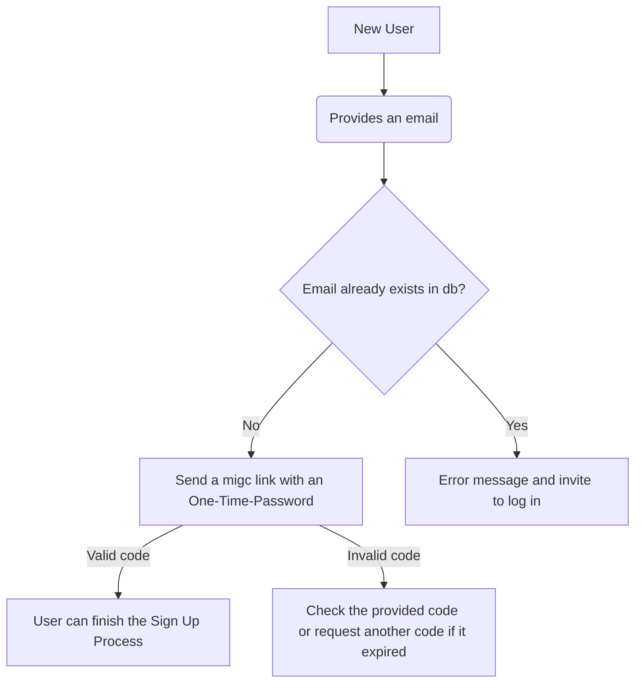

# auth-strategies

## Authentication strategies

### Le's exploring the different authentication strategies by taking advantage of the cookies and sessions.

#### 1. Magic link

```mermaid
flowchart
S[New User] --> A
A(Provides an email) --> B{Email already exists in db?}
B --> |No| C[Send a migc link with an One-Time-Password]
B --> |Yes| D[Error message and invite to log in]
C --> |Valid code| E[User can finish the Sign Up Process]
C --> |Invalid code| F[Check the provided code or request another code if it expired]
```
